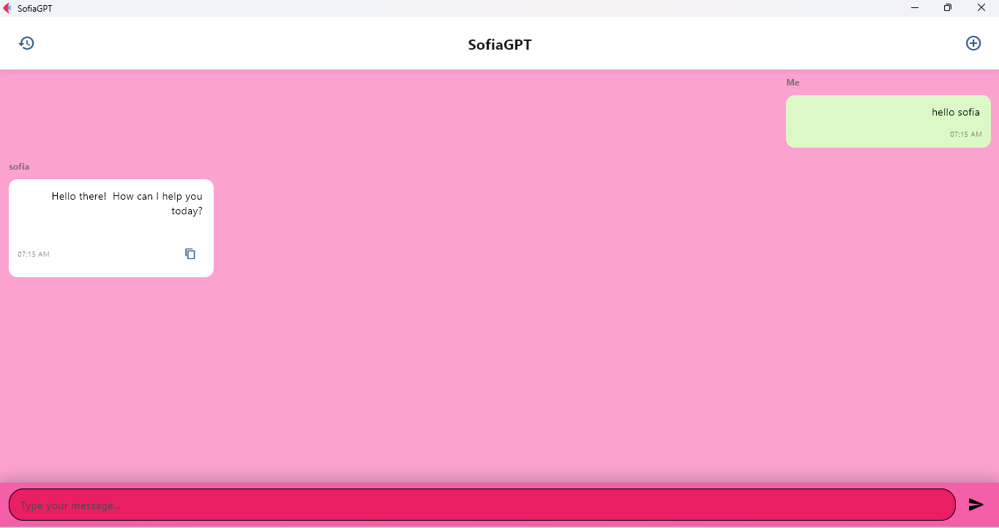
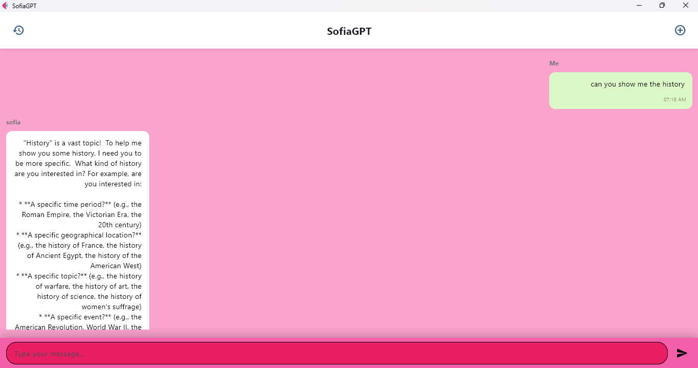

# ChatBot Application using Python Flet

## 📊 Project Overview

A modern, cross-platform chatbot application built with Python and Flet framework. This application provides an interactive conversational interface with a sleek UI, real-time messaging capabilities, and intelligent response generation.

---

## 📸 Screenshots

### Main Interface

*Main chat interface with conversation view*

### Conversation Example

*Example interaction with the chatbot*

---

## 🎯 Features

- **Real-time Messaging**: Instant message sending and receiving
- **Clean UI**: Modern, responsive interface built with Flet components
- **Cross-Platform**: Runs on Windows, macOS, Linux, and web browsers
- **Conversation History**: Maintains chat history during session
- **Typing Indicators**: Visual feedback when bot is processing
- **Customizable Responses**: Easy to modify response logic
- **Lightweight**: Minimal dependencies, fast performance

---

## 🛠️ Technologies Used

- **Python 3.8+**: Core programming language
- **Flet**: Framework for building cross-platform applications
- **Custom Logic**: Rule-based or AI-powered response system

---
